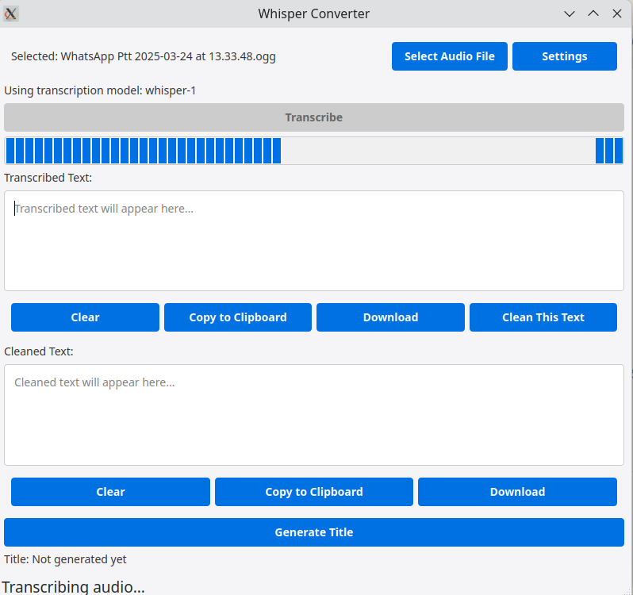

# Whisper-Converter-Linux
 
 

[](https://www.python.org/downloads/)
 [](https://openai.com/blog/openai-api)
 
A desktop utility for Linux that allows users to transcribe audio files using OpenAI's Whisper API and clean up the transcribed text using GPT-4o-mini.

## Why This Tool?

While there are many transcription tools available for Windows and macOS, Linux users often have fewer options, especially when it comes to applications that leverage OpenAI's Whisper API. This tool aims to fill that gap by providing a native Linux desktop application for audio transcription and text refinement.

## Features

- Upload audio files for transcription using OpenAI Whisper API
- Choose between different OpenAI speech-to-text models
- Store API keys securely and persistently
- Edit transcribed text
- Clean up text using GPT-4o-mini
- Generate titles using OpenAI LLM
- Download the transcribed/cleaned text
- Copy text to clipboard

## Two-Part Process

The application offers a two-stage approach to transcription:

1. **Transcription Stage**: Convert audio to text using OpenAI's speech-to-text models. This can be used as a standalone feature if you only need raw transcription.

2. **Refinement Stage**: Clean up the transcribed text using GPT-4o-mini, which can:
   - Fix typos and grammatical errors
   - Add paragraph spacing and formatting
   - Remove redundancies and filler words
   - Process self-corrections (e.g., "actually, delete that")
   - Add bullet points and headers for better readability

The two-stage approach allows for cost efficiency, as you can use the more affordable GPT-4o-mini for text refinement rather than more expensive models.

## Installation

1. Clone this repository:
   ```
   git clone https://github.com/yourusername/Whisper-Converter-Linux.git
   cd Whisper-Converter-Linux
   ```

2. Install the required dependencies:
   ```
   pip install -r requirements.txt
   ```

3. Run the application:
   ```
   ./run.sh
   ```

4. Or build a standalone executable:
   ```
   ./build.sh
   ```

## Requirements

- Python 3.8+
- PyQt6
- OpenAI API key

## License

MIT
